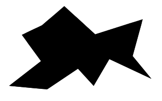
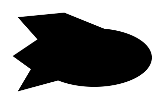
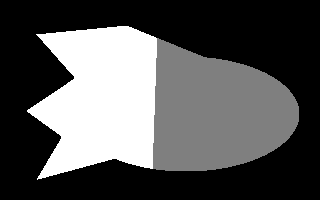
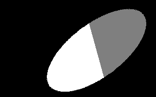

# Example of using scipy.optimize

Read about optimization methods with SciPy https://docs.scipy.org/

### Task

Divide figure on image with a random shape by two parts with equal areas.

### Example 1

Result:

### Example 2

Result:

### Example 3

Result:

