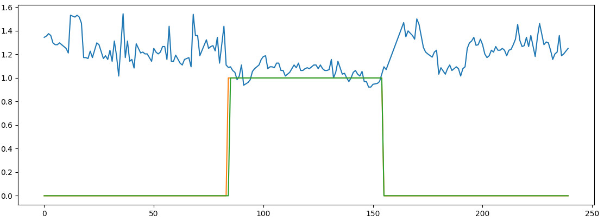
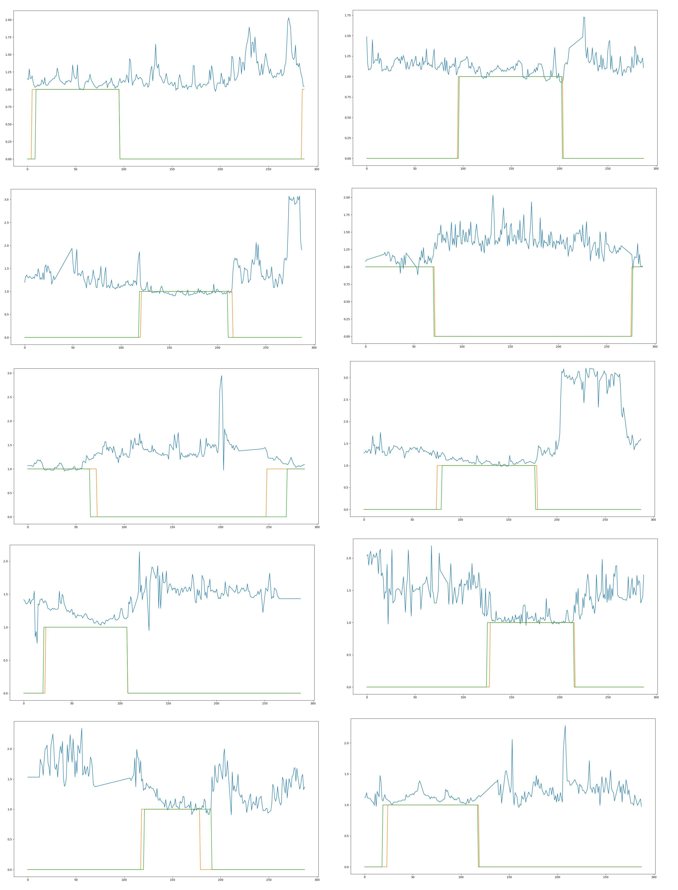

# Model to search for real sleep interval by pulse measurements in large time period

Nothing special, details in docstrings.

### Chart with example

~~~
blue - pulse (bpm value / individual resting)
orange - real sleep interval
green - predicted sleep interval
~~~

### Few examples

