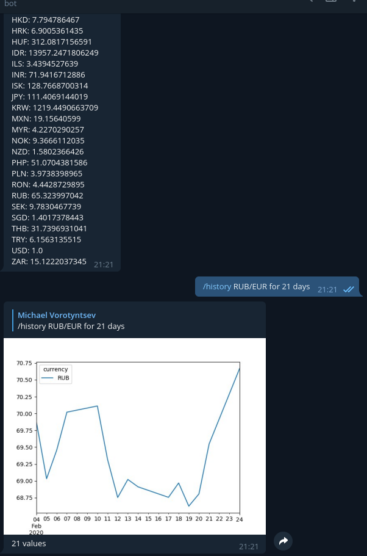

# Rates exchange telegram bot

### Howto run it

At first you have to write your bot token value into `docker-compose.yml`.
Launch as Docker container using docker-compose file:

`docker-compose up --build`

Env variables:

    BOT_TOKEN - bot token

    ACTUAL_INTERVAL - update frequency (in minutes)

    DB_FILE - local db filepath (csv file)

Testing requirements:
~~~
pytest==5.2.0
pytest-sugar==0.9.2
pytest-cov==2.7.1
pytest-asyncio==0.10.0
~~~

### Help command

Answer content:
~~~
    Commands:
        /list or /lst - returns list of all available rates
        /exchange $10 to CAD or  /exchange 10 USD to CAD - converts to the second currency with two decimal precision
        /history USD/CAD for 7 days - return an image graph chart which shows the exchange rate graph/chart of the selected currency for the last 7 days
        /help - get this message again
~~~

